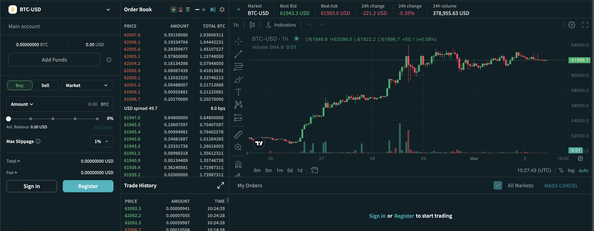

# Cex Trading App

## License
Apache License, Version 2.0

Demo: 

* Connect to docker portgresql
docker exec -it yiialkalmi_postgres_1 psql -U project -W project
yiialkalmi_postgres_1 tên container hoặc id container
-U project người dùng
-W yêu cầu nhắc nhập mật khẩu
project tên database

docker compose exec db psql --username=hello_django --dbname=hello_django_dev

* require docker desktop
docker compose up -d
docker exec -it backend-dev-1 python manage.py migrate
docker exec -it backend-dev-1 python manage.py collectstatic
docker compose up 

docker exec -it bitnano python wizard.py
